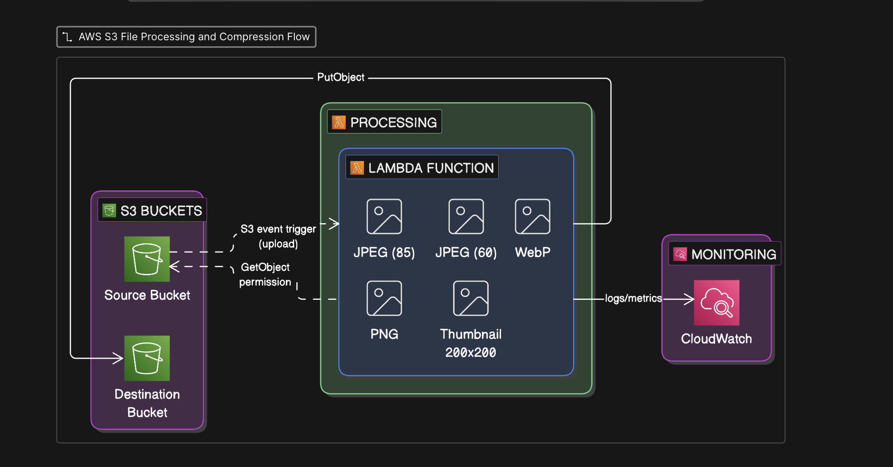

# AWS Image Processor

A serverless image processing application built with **AWS Lambda, Amazon S3, Python, Pillow, Docker, and Terraform**.

When an image is uploaded to an S3 bucket, an S3 event triggers an AWS Lambda function. The function downloads the image, processes it with Pillow, generates multiple optimized versions plus a thumbnail, and uploads them to a separate processed bucket. All AWS infrastructure is provisioned and managed with Terraform.

---

## Table of Contents

1. [Overview](#overview)
2. [Features](#features)
3. [Technologies Used](#technologies-used)
4. [Project Structure](#project-structure)
5. [Image Processing](#image-processing)
6. [Prerequisites](#prerequisites)
7. [Setup and Deployment](#setup-and-deployment)
8. [Testing](#testing)
9. [Configuration](#configuration)
10. [Infrastructure Components](#infrastructure-components)
11. [Monitoring](#monitoring)
12. [Cleanup](#cleanup)
13. [Troubleshooting](#troubleshooting)
14. [Security](#security)
15. [Implementation Notes](#implementation-notes)
16. [Skills Demonstrated](#skills-demonstrated)

---

## Overview



| Stage | Component                | Role                                                              |
| ----- | ------------------------ | ----------------------------------------------------------------- |
| 1     | Upload S3 bucket         | Receives original images from the user                            |
| 2     | S3 `ObjectCreated` event | Triggers the Lambda function automatically                        |
| 3     | AWS Lambda (Python 3.12) | Downloads, resizes, converts, and generates variants using Pillow |
| 4     | Processed S3 bucket      | Stores every generated image variant                              |
| 5     | CloudWatch Logs          | Captures logs for monitoring and debugging                        |

There is no always-running server. Lambda runs only when an image is uploaded, which makes this design well suited to event-driven workloads such as image processing, file conversion, thumbnail generation, and media optimization.

---

## Features

- Serverless, event-driven image processing
- Automatic processing triggered by S3 uploads
- Infrastructure as Code with Terraform
- Pillow-based image manipulation
- JPEG, WEBP, and PNG conversion
- Automatic compression and thumbnail generation
- Maximum image dimension control
- Unique output filenames
- S3 object metadata
- CloudWatch-compatible logging
- Docker-based Lambda layer creation
- Automated deployment and cleanup scripts

---

## Technologies Used

| Technology     | Purpose                                 |
| -------------- | --------------------------------------- |
| AWS S3         | Store uploaded and processed images     |
| AWS Lambda     | Serverless image processing             |
| AWS IAM        | Permissions for Lambda and AWS services |
| AWS CloudWatch | Lambda logs and monitoring              |
| Python 3.12    | Lambda runtime                          |
| Pillow         | Image processing                        |
| boto3          | AWS SDK for Python                      |
| Terraform      | Infrastructure as Code                  |
| Docker         | Builds a Linux-compatible Lambda layer  |
| Bash           | Deployment and destruction automation   |
| jq             | Parsing AWS CLI JSON responses          |

---

## Project Structure

```text
image-processor/
├── scripts/
│   ├── deploy.sh
│   ├── destroy.sh
│   └── build_layer_docker.sh
├── lambda/
│   ├── lambda_function.py
│   └── requirements.txt
├── images/
│   └── image.png
├── terraform/
│   ├── main.tf
│   ├── variables.tf
│   ├── outputs.tf
│   ├── iam.tf
│   ├── lambda.tf
│   ├── s3.tf
│   ├── provider.tf
│   ├── terraform.tfvars
│   └── pillow_layer.zip
└── README.md
```

> Exact Terraform filenames may vary depending on the implementation.

---

## Image Processing

### Generated Variants

Every uploaded image produces the following files:

| Variant     | Format | Quality  |
| ----------- | ------ | -------- |
| Compressed  | JPEG   | 85       |
| Low Quality | JPEG   | 60       |
| WebP        | WEBP   | 85       |
| PNG         | PNG    | Lossless |
| Thumbnail   | JPEG   | 80       |

### Output Naming

Each generated file includes an 8-character unique ID to avoid collisions.

| Variant     | Example filename                   |
| ----------- | ---------------------------------- |
| Compressed  | `original_compressed_abc12345.jpg` |
| Low Quality | `original_low_abc12345.jpg`        |
| WebP        | `original_webp_abc12345.webp`      |
| PNG         | `original_png_abc12345.png`        |
| Thumbnail   | `original_thumbnail_abc12345.jpg`  |

### Size Handling

- Maximum dimension: **4096 x 4096**
- Larger images are resized automatically while keeping the aspect ratio (for example, 8000 x 6000 becomes 4096 x 3072)
- Resizing uses Pillow's `LANCZOS` algorithm for high quality

### Processing Steps

1. Receive the S3 event and extract the bucket name and object key
2. Download the image with boto3
3. Open the image with Pillow
4. Convert the image mode if required
5. Check dimensions and resize if above 4096px
6. Generate all variants and the thumbnail
7. Upload results to the processed bucket

### Supported Formats

JPEG, PNG, WEBP, BMP, TIFF

---

## Prerequisites

Install the following before deploying:

| Tool      | Notes                                     |
| --------- | ----------------------------------------- |
| AWS CLI   | Configured with valid credentials         |
| Terraform | Infrastructure provisioning               |
| Docker    | Must be running to build the Lambda layer |
| jq        | Used by the scripts                       |
| Git       | Version control                           |

**AWS credentials:** configure the AWS CLI with your Access Key ID, Secret Access Key, default region (for example `ap-south-1`), and output format `json`. Confirm your identity with `aws sts get-caller-identity` before deploying.

---

## Setup and Deployment

### Configure Terraform Variables

Before deploying, create a file named `terraform.tfvars` inside the `terraform/` directory and add the following values:

```hcl
aws_region         = "ap-south-1"
environment        = "dev"
project_name       = "image-processor"
lambda_timeout     = 60
lambda_memory_size = 1024

allowed_origins = ["*"]

# Production example:
# allowed_origins = ["https://myapp.com", "https://www.myapp.com"]
```

| Variable             | Description                                          | Example           |
| -------------------- | ---------------------------------------------------- | ----------------- |
| `aws_region`         | AWS region where all resources are created           | `ap-south-1`      |
| `environment`        | Environment name, used in resource names             | `dev`             |
| `project_name`       | Project name, used as a prefix for resource names    | `image-processor` |
| `lambda_timeout`     | Maximum Lambda execution time in seconds             | `60`              |
| `lambda_memory_size` | Memory allocated to the Lambda function in MB        | `1024`            |
| `allowed_origins`    | List of origins allowed to access the buckets (CORS) | `["*"]`           |

> Use `["*"]` for development only. In production, list your exact domains instead.
>
> The values above are suggested examples. Adjust them to your needs, and make sure the variable names match those declared in `variables.tf`.

### Lambda Layer (Docker)

Pillow contains native components, so it must be built for the Linux environment used by AWS Lambda rather than installed directly on macOS or Windows. The `build_layer_docker.sh` script handles this by:

1. Starting a temporary `python:3.12-slim` container with `linux/amd64` platform
2. Installing Pillow inside the container
3. Creating the Lambda layer directory structure
4. Producing `pillow_layer.zip`
5. Copying the ZIP to `terraform/pillow_layer.zip`
6. Removing the temporary container

### Automated Deployment

After creating `terraform.tfvars`, the `deploy.sh` script (make it executable first) performs these steps in order:

1. Check that the AWS CLI is installed
2. Check that Terraform is installed
3. Build the Pillow Lambda layer
4. Initialize Terraform
5. Create a Terraform plan
6. Apply the infrastructure
7. Display deployment outputs

### Manual Deployment

You can also work directly in the `terraform/` directory using the standard Terraform workflow: initialize, validate, format, plan, and apply. Type `yes` when Terraform asks for confirmation.

---

## Testing

1. Read the upload bucket name from the Terraform outputs (`upload_bucket_name`).
2. Upload any supported image to that bucket using the AWS CLI.
3. The S3 event triggers Lambda automatically.
4. Read the processed bucket name from the Terraform outputs (`processed_bucket_name`) and list its contents.
5. Confirm that the five generated variants appear, then download any of them (individually or recursively) to inspect the result.

---

## Configuration

### Environment Variables

| Variable           | Description                              | Default          |
| ------------------ | ---------------------------------------- | ---------------- |
| `PROCESSED_BUCKET` | Bucket where processed images are stored | Set by Terraform |
| `LOG_LEVEL`        | Logging verbosity                        | `INFO`           |

### S3 Buckets

| Bucket    | Example name                          | Purpose                    |
| --------- | ------------------------------------- | -------------------------- |
| Upload    | `image-processor-dev-upload-xxxxx`    | Stores original uploads    |
| Processed | `image-processor-dev-processed-xxxxx` | Stores generated variants  |
| Frontend  | Provisioned when required             | Hosts the frontend if used |

---

## Infrastructure Components

Terraform manages all of the following, so they can be created, updated, and destroyed consistently:

- S3 upload bucket
- S3 event notification
- Lambda function
- Processed S3 bucket
- Lambda IAM role and policies
- Lambda layer
- S3 bucket policies and configuration

**Benefits of Infrastructure as Code:** repeatable infrastructure, version-controlled configuration, automated provisioning, easy environment recreation, easy cleanup, and less manual configuration.

---

## Monitoring

Lambda logs are available in Amazon CloudWatch. The log level is controlled by the `LOG_LEVEL` environment variable.

Logged events include:

- Received event
- Processing image
- Original image dimensions
- Image resizing
- Variant creation
- Uploading processed image
- Successful processing
- Errors

---

## Cleanup

The `destroy.sh` script safely tears down the project. It exists because Terraform cannot delete S3 buckets that still contain objects, versions, or delete markers.

The script:

1. Finds bucket names from the Terraform state
2. Checks whether each bucket still exists
3. Deletes all objects
4. Deletes all object versions
5. Deletes all delete markers
6. Runs `terraform destroy`

### Why Versioning Needs Special Cleanup

With S3 versioning enabled, deleting an object does not remove its older versions. Terraform then fails with a `BucketNotEmpty` error (HTTP 409). The script uses `aws s3api list-object-versions` and `aws s3api delete-objects` to remove every version and delete marker first.

### Already Deleted Buckets

If a bucket was deleted manually but is still in the Terraform state, listing its versions returns `NoSuchBucket`. The script checks each bucket with `aws s3api head-bucket` first and skips cleanup for any bucket that no longer exists, so Terraform can continue.

---

## Troubleshooting

| Problem                                         | Cause                                          | Fix                                                                                                                                                                                                                                      |
| ----------------------------------------------- | ---------------------------------------------- | ---------------------------------------------------------------------------------------------------------------------------------------------------------------------------------------------------------------------------------------- |
| `permission denied` when running a script       | Script is not executable                       | Add execute permission with `chmod +x` on the script                                                                                                                                                                                     |
| Layer build fails                               | Docker is not running                          | Start Docker Desktop, confirm with `docker info`, rerun the build script                                                                                                                                                                 |
| AWS authentication error                        | Missing or invalid credentials                 | Verify with `aws sts get-caller-identity`, then reconfigure with `aws configure`                                                                                                                                                         |
| Terraform state references a deleted bucket     | Bucket removed manually                        | Inspect with `terraform state list` and `terraform state show`; only if the resource is truly gone and Terraform cannot reconcile it, remove it with `terraform state rm`. Never use `state rm` as a replacement for `terraform destroy` |
| `BucketNotEmpty` (409) during destroy           | Objects, versions, or delete markers remain    | Run `destroy.sh`, which cleans all of them before `terraform destroy`                                                                                                                                                                    |
| Processed bucket keeps refilling during cleanup | Lambda is still being triggered by new uploads | Stop all uploads before destroying the environment                                                                                                                                                                                       |

---

## Security

- The Lambda IAM role should follow the principle of least privilege
- Typical permissions: S3 read, S3 write, and CloudWatch Logs
- Do **not** grant broad permissions such as `AdministratorAccess`

---

## Implementation Notes

- **Pillow Layer:** Pillow is packaged as a Lambda layer instead of inside the function package, and Docker builds it in a Lambda-compatible Linux environment.
- **Unique Output Names:** each request generates an 8-character UUID-based ID (`str(uuid.uuid4())[:8]`).
- **Unused Constants:** `SUPPORTED_FORMATS` and `DEFAULT_QUALITY` are defined in the code but do not currently drive processing. The actual variants are defined directly in the `variants` list.

---

## Skills Demonstrated

| Area         | Details                                                  |
| ------------ | -------------------------------------------------------- |
| AWS          | S3, Lambda, IAM, CloudWatch                              |
| Development  | Python Lambda development, boto3, Pillow                 |
| Architecture | S3 event-driven, serverless design                       |
| DevOps       | Terraform, Infrastructure as Code, Docker, Lambda layers |
| Automation   | Bash scripting, automated deployment and cleanup         |
| Operations   | S3 versioning, cloud resource troubleshooting            |

---
